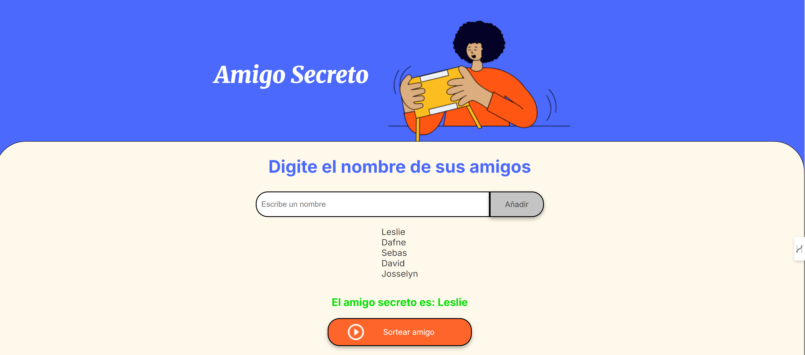

# 🎁 Amigo Secreto - Alura Latam Challenge  

Este es un proyecto desarrollado para el **Challenge de Alura Latam**, donde creamos una aplicación web interactiva para organizar un **Amigo Secreto** de forma sencilla y divertida.  

## 📌 Funcionalidades  
✅ Registro de participantes.  
✅ Sorteo aleatorio del amigo secreto.  
✅ Interfaz dinámica con JavaScript.  
✅ Diseño responsivo con CSS.  

## 🚀 Tecnologías utilizadas  
- 🖥️ **HTML** → Estructura de la aplicación.  
- 🎨 **CSS** → Estilos y diseño responsivo.  
- ⚡ **JavaScript** → Lógica del sorteo y manipulación del DOM.  

## 📂 Cómo usar el proyecto  
1. **Descarga o clona el repositorio:**  
   ```bash
   git clone https://github.com/LeslieSanz/LeslieSanz-challenge-amigo-secreto-one.git
   cd LeslieSanz-challenge-amigo-secreto-one

## 🎲 Sorteo en acción


## 📜 Licencia
Este proyecto es de código abierto y puedes usarlo libremente. 🎉